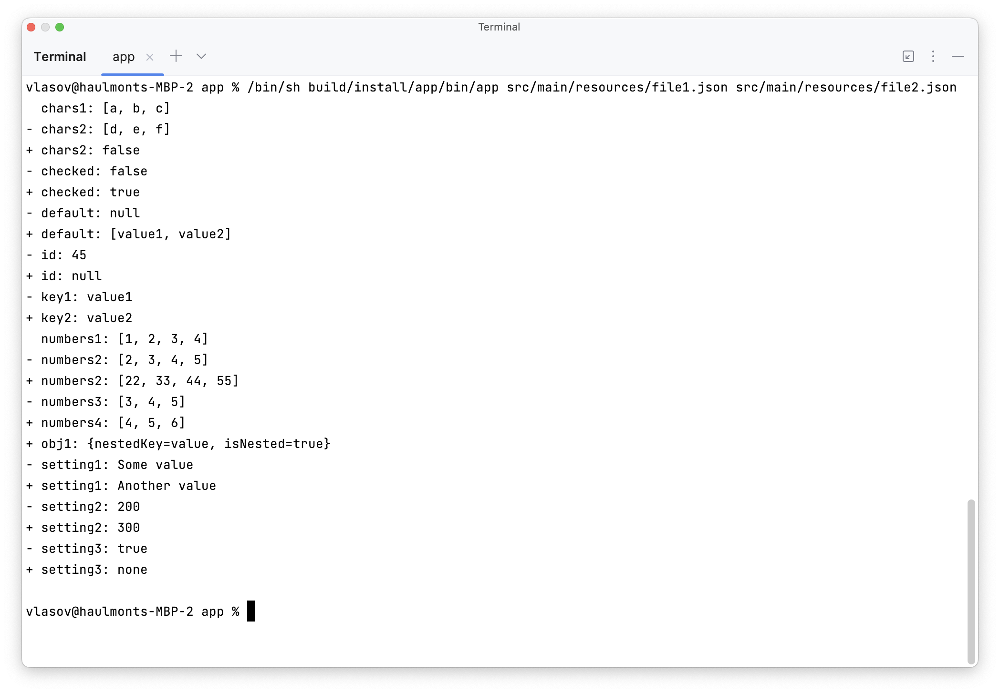

### Hexlet tests and linter status:

# Diff Finder

The repository contains a source code for a CLI tool that helps to find the difference between two data structures.

## Help

## Basic flow

Just run the app and pass two files (both .json or .yaml) as parameters. The program will print out the difference 
between them: 

## Formats

The program supports three formats:

- stylish (the default one)
- plain
- json

### Stylish

### Plain

### Json

